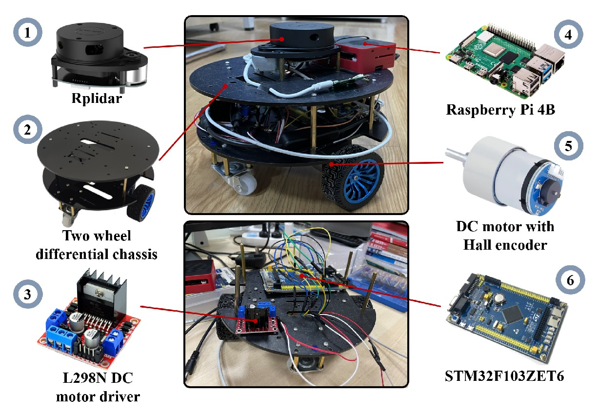
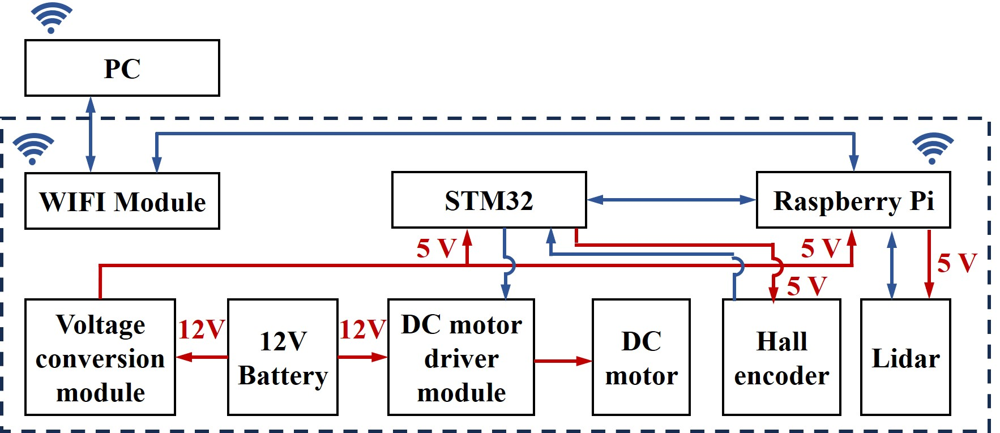

## mobile_robot_in_wheat_fields_based_on_slam
We have developed an autonomous ground mobile robot that can use laser SLAM to construct a 2D occupation grid map of wheat fields. Subsequently, the robot's localization, path planning, and motion control are achieved using the map, 2D point clouds, and wheel odometry, enabling the robot to autonomously navigate and avoid obstacles in wheat fields.

The robot system primarily comprises two key modules: a lower-level motion control module and an upper-level perception planning module. The lower-level control module encompasses components such as a 12V power supply, a 5V voltage conversion module, a DC motor drive module, DC motors with Hall encoders, and an STM32 MCU. The STM32 utilizes PWM to achieve basic regulation of the DC motor through the motor driver. Subsequently, it monitors the motor speed in real-time using the Hall encoder and constructs a PID controller to implement closed-loop control of the DC motor's speed.

The upper-level module primarily consists of a Raspberry Pi and a 2D lidar. The Raspberry Pi runs Robot Operating System (ROS) based on Ubuntu 20.04, and utilizes the Navigation package in ROS to achieve mapping, localization, and path planning for the robot. Specifically, it first constructs a 2D grid map of the wheat field environment using the SLAM (Simultaneous Localization and Mapping) algorithm. Then, based on the map information, 2D lidar scanning data, and wheel odometry, it employs the Adaptive Monte Carlo Localization (AMCL) algorithm to locate the robot. Subsequently, the A* global path planning algorithm is used to construct a global path from the robot's current location to its destination, while the Dynamic Window Approach (DWA) local path planning algorithm is utilized for local obstacle avoidance and ultimately generates motion velocity for the robot. The upper-level module communicates with the lower-level module through a designed serial communication program for data exchange. The lower-level module provides feedback on the real-time wheel speed for odometry calculation and robot localization in the upper-level module. The upper-level module sends the speed control information to the lower-level module to drive the robot's motion and execute specific navigation and obstacle avoidance operations.

The robot was tested in a real wheat field, constructing a 2D map as follows:

The robot could successfully achieve autonomous navigation and obstacle avoidance as follows:

## Author
Yibo Zhou

College of Mechanical and Electronic Engineering, Northwest A&F University
